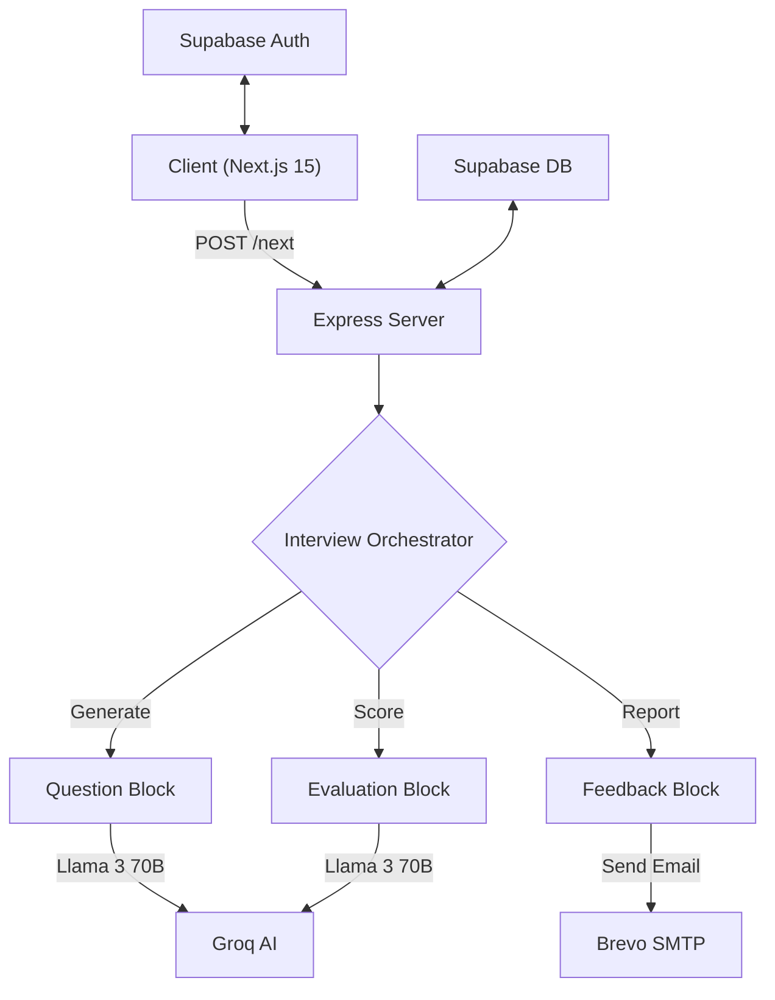

<div align="center">

# 🤖 Mock Mentor AI

### Intelligent, Adaptive, Role-Specific Interview Practice

[](https://nextjs.org/)
[](https://react.dev/)
[](https://tailwindcss.com/)
[](https://nodejs.org/)
[](https://groq.com/)
[](https://supabase.com/)

[Features](#-features) • [Installation](#-getting-started) • [Architecture](#-architecture) • [Roadmaps](#-interview-roadmaps) • [API Docs](API.md) • [Contributing](#-contributing)

</div>

---

## 🚀 Overview

**Mock Mentor** is a cutting-edge AI interview platform designed to simulate real-world technical interviews. It uses **Groq's Ultra-Fast LPU™** technology with **Llama 3** models to provide intelligent, adaptive questioning and comprehensive evaluation with near-instant responses.

Data persistence and authentication are powered by **Supabase**, offering a seamless and secure user experience.

---

## ✨ Features

### 🧠 Intelligent Roadmap Engine

- **5-Step Strict Progression**: Organized interview flow covering key competencies.
- **Roles & Levels**: Customized for Freshers, Juniors, and Seniors across 14+ roles.
- **Adaptive Difficulty**: Questions adjust dynamically based on your performance.

### ⚡ Powered by Groq & Llama 3

- **Speed**: Lightning-fast response generation using Groq.
- **Intelligence**: Advanced reasoning with Llama 3 70B models.
- **Efficiency**: Optimized for real-time conversational latency.

### 📊 Smart Dashboard & Analytics

- **Performance Trends**: Visualize your progress over time with interactive charts.
- **Your Goals**: Set and track personalized interview preparation goals.
- **Recent Achievements**: Earn badges and track milestones.
- **Pro Tips**: Daily actionable advice for interview success.

### 📝 Detailed Session Reports

- **Real-time Feedback**: Instant scoring after every answer.
- **Comprehensive Analysis**:
  - 🛠️ **Technical Accuracy**
  - 🗣️ **Communication Clarity**
  - 🔍 **Depth of Understanding**
- **Session History**: Review past interviews in detail.
- **Downloadable Reports**: Export session summaries for offline review.
- **Email Notifications**: Get your performance report delivered straight to your inbox via **Brevo**.

### 🎨 Modern, Professional UI

- **Cutting-Edge Stack**: Built with **Next.js 15.1**, **React 19**, and **Tailwind CSS 4**.
- **Responsive Design**: Seamless experience across all devices.
- **Audio Mode**: Speak your answers with real-time transcription.
- **Theme Support**: Beautiful light and dark modes with **Shadcn/UI** components.

### 🛡️ Secure & Scalable

- **Supabase Auth**: Secure Email/Password and Social Login.
- **Role-Based Access**: Protected routes and API endpoints.
- **Rate Limiting**: Intelligent request throttling for stability.
- **Data Privacy**: Full control over your data with permanent account deletion.

---

## 🏗️ Architecture

Mock Mentor uses a **Composable Block Architecture** in the backend for modularity and scalability.



### Key Services

| Service               | Responsibility                             | Technology                |
| --------------------- | ------------------------------------------ | ------------------------- |
| **RoleBlock**         | Define specific focus areas per job role   | Logic Strategies          |
| **QuestionGenerator** | Create adaptive, unique questions          | `llama-3.3-70b-versatile` |
| **EvaluationBlock**   | Score answers against rubrics              | `llama-3.3-70b-versatile` |
| **EmailService**      | Send performance reports                   | **Brevo (SMTP)**          |
| **DatabaseService**   | Persist sessions, questions, and responses | **Supabase (PostgreSQL)** |

---

## 🗺️ Interview Roadmaps

Every interview follows a specific path. Examples for "Frontend Developer":

| Step  | 🌱 Fresh / Junior     | 💎 Senior / Lead            |
| ----- | --------------------- | --------------------------- |
| **1** | **HTML/CSS & DOM**    | **System Architecture**     |
| **2** | **JavaScript Basics** | **Performance Engineering** |
| **3** | **React Basics**      | **Micro-frontends**         |
| **4** | **Debugging**         | **Advanced Security**       |
| **5** | **Version Control**   | **Leadership & Strategy**   |

### Supported Roles

Mock Mentor supports **14 unique job roles** including Frontend, Backend, Full Stack, DevOps, Data Science, and more.

---

## 🛠️ Project Structure

```text
mock-mentor/
├── backend/                  # Express.js API
│   ├── src/
│   │   ├── services/         # Core Business Logic
│   │   │   ├── blocks/       # AI Logic Blocks
│   │   │   ├── email.service.js    # Brevo Integration
│   │   │   ├── database.service.js # Supabase Integration
│   │   │   └── ai.service.js       # Groq Integration
│   │   ├── middleware/       # Auth & Security Middleware
│   │   └── server.js         # Entry Point
│   └── package.json
│
├── frontend/                 # Next.js 15 Application
│   ├── app/                  # App Router Pages
│   ├── components/           # React Components (Shadcn + Radix)
│   ├── lib/                  # Utilities (Supabase Client)
│   └── package.json
│
└── supabase/                 # Database Schema & Migrations
```
## 🧪 Testing

We use [Playwright](https://playwright.dev/) for End-to-End (E2E) testing to ensure the platform functions correctly across modern browsers (Chromium, Firefox, and WebKit).

### Prerequisites
Before running the tests, ensure you have installed the necessary Playwright browsers by running the following command from the `frontend` directory:

```bash
cd frontend
npx playwright install --with-deps

---

## 🚀 Getting Started

### Prerequisites

- **Node.js** 18.0+
- **Groq API Key** ([Get it here](https://console.groq.com/))
- **Supabase Account** ([Get it here](https://supabase.com/))
- **Brevo Account** (Optional, for email reports)

### Installation

1. **Clone the Repository**

   ```bash
   git clone https://github.com/yourusername/mock-mentor.git
   cd mock-mentor
   ```

2. **Backend Setup**

   ```bash
   cd backend
   npm install

   # Create .env
   echo "PORT=8000" > .env
   echo "GROQ_API_KEY=your_groq_key" >> .env
   echo "SUPABASE_URL=your_supabase_url" >> .env
   echo "SUPABASE_KEY=your_supabase_service_role_key" >> .env
   # Email Service (Brevo)
   echo "BREVO_API_KEY=your_brevo_api_key" >> .env
   echo "BREVO_SMTP_HOST=smtp-relay.brevo.com" >> .env
   echo "BREVO_SMTP_PORT=587" >> .env
   echo "BREVO_SENDER_EMAIL=noreply@yourdomain.com" >> .env
   echo "BREVO_SENDER_NAME=Mock Mentor" >> .env
   ```

3. **Frontend Setup**

   ```bash
   cd ../frontend
   npm install

   # Create .env.local
   echo "NEXT_PUBLIC_BACKEND_URL=http://localhost:8000" > .env.local
   echo "NEXT_PUBLIC_SUPABASE_URL=your_supabase_url" >> .env.local
   echo "NEXT_PUBLIC_SUPABASE_ANON_KEY=your_supabase_anon_key" >> .env.local
   ```

4. **Database Setup**
   - Run the SQL scripts from `supabase/schema.sql` (if available) in your Supabase SQL Editor to create tables.

5. **Run the Application**

   **Backend**: `cd backend && npm run dev`

   **Frontend**: `cd frontend && npm run dev`

   Visit **http://localhost:3000** to start!

---

## 🤝 Contributing

We love contributions! Please follow these steps:

1. Fork the repository.
2. Create your feature branch (`git checkout -b feature/AmazingFeature`).
3. Commit your changes (`git commit -m 'Add some AmazingFeature'`).
4. Push to the branch (`git push origin feature/AmazingFeature`).
5. Open a Pull Request.

---

<div align="center">
  <sub>Built by <b>Gunesh Bari</b></sub>
</div>
