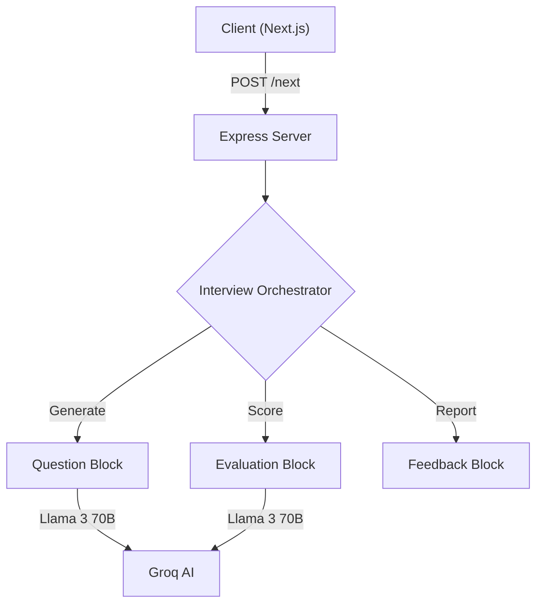

<div align="center">

# 🤖 Mock Mentor AI
### Intelligent, Adaptive, Role-Specific Interview Practice

[](https://nextjs.org/)
[](https://nodejs.org/)
[](https://groq.com/)
[](https://www.typescriptlang.org/)
[](https://tailwindcss.com/)

[Features](#-features) • [Installation](#-getting-started) • [Architecture](#-architecture) • [Roadmaps](#-interview-roadmaps) • [API Docs](API.md) • [Contributing](#-contributing) • [Changelog](CHANGELOG.md)

</div>

---

## 🚀 Overview

**Mock Mentor** is a cutting-edge AI interview platform designed to simulate real-world technical interviews. It uses **Google's Gemini 2.0 Flash** AI model to provide intelligent, adaptive questioning and comprehensive evaluation with human-like reasoning.

---

## ✨ Features

### 🧠 Intelligent Roadmap Engine
- **5-Step Strict Progression**: Organized interview flow.
- **Roles & Levels**: Customized for Freshers, Mid-level, and Seniors.
- **Adaptive**: Adjusts difficulty based on your answers.

### ⚡ Powered by Groq AI
- **Speed**: Lightning-fast response times using Groq's LPU™.
- **Intelligence**: Advanced reasoning with Llama 3 models.
- **Flexibility**: Support for various open-source models via Groq.

### 📊 Comprehensive Analytics
- **Real-time Feedback**: Instant scoring after every answer.
- **Final Report**: A detailed breakdown of your performance across:
  - 🛠️ **Technical Accuracy**
  - 🗣️ **Communication Clarity**
  - 🔍 **Depth of Understanding**
  - ✅ **Completeness**

### 🎨 Modern, Professional UI
- **Professional Design**: Clean blue color scheme with enhanced typography and spacing.
- **Responsive Layout**: Seamless experience across desktop, tablet, and mobile devices.
- **Audio Mode**: Full Speech-to-Text and Text-to-Speech support for a hands-free experience.
- **Modern Components**: Built with **Shadcn/UI**, **Tailwind CSS**, and smooth animations.
- **Theme Support**: Beautiful light and dark modes with system preference detection.
- **Live Progress**: Visual tracking of your 5-step interview journey.

---

## 🏗️ Architecture

Mock Mentor uses a **Composable Block Architecture** in the backend to separate concerns and allow for easy scalability.



### Key Services
| Service | Responsibility | Model Used |
|---------|----------------|------------|
| **RoleBlock** | Define specific focus areas per job role | N/A (Role Strategies) |
| **QuestionGenerator** | Create adaptive, unique questions | `llama-3.3-70b-versatile` |
| **EvaluationBlock** | Score answers against rubrics | `llama-3.3-70b-versatile` |
| **FeedbackBlock** | Compile final detailed report | `llama-3.3-70b-versatile` |
| **AnswerAnalyzer** | Analyze answer quality and depth | `llama-3.3-70b-versatile` |
| **QuestionElaboration** | Elaborate on questions for clarity | `llama-3.3-70b-versatile` |

---

## 🗺️ Interview Roadmaps

Every interview follows a specific path. Here are examples of how the "Frontend Developer" track differs by level:

| Step | 🌱 Fresh / Junior | 💎 Senior / Lead |
|------|-------------------|------------------|
| **1** | **HTML/CSS & DOM** <br>*(Box model, Semantic HTML)* | **System Architecture** <br>*(Scalability, Monorepos)* |
| **2** | **JavaScript Basics** <br>*(ES6+, Arrays, Events)* | **Performance Engineering** <br>*(Web Vitals, SSR vs CSR)* |
| **3** | **React Basics** <br>*(Props, State, Components)* | **Micro-frontends** <br>*(Module Federation, Strategy)* |
| **4** | **Debugging** <br>*(Console, Common errors)* | **Advanced Security** <br>*(XSS/CSRF, Auth patterns)* |
| **5** | **Version Control** <br>*(Git basics)* | **Leadership & Strategy** <br>*(Mentoring, Tech choices)* |


### Supported Roles

Mock Mentor supports **14 different job roles**, each with customized questions:

- 💻 Frontend Developer
- ⚙️ Backend Developer
- 🔄 Full Stack Developer
- 🚀 DevOps Engineer
- 📊 Data Scientist
- 🤖 Machine Learning Engineer
- 📱 Mobile Developer
- 🧪 QA Engineer
- 📋 Product Manager
- 🎨 UI/UX Designer
- 🏛️ Software Architect
- ☁️ Cloud Engineer
- 🔒 Security Engineer
- 🗄️ Database Administrator

Each role has **45 unique questions** across all interview types and experience levels. For detailed roadmaps, see [ROADMAPS.md](ROADMAPS.md).

---


## 🛠️ Project Structure

```text
mock-mentor/
├── backend/                  # Express.js API
│   ├── src/
│   │   ├── services/         # Core Business Logic
│   │   │   ├── blocks/       # AI Logic Blocks
│   │   │   │   ├── RoleBlock.js
│   │   │   │   ├── RoleStrategies.js
│   │   │   │   ├── QuestionGeneratorBlock.js
│   │   │   │   ├── QuestionElaborationBlock.js
│   │   │   │   ├── EvaluationBlock.js
│   │   │   │   ├── AnswerAnalyzer.js
│   │   │   │   └── FeedbackBlock.js
│   │   │   ├── GroqService.js      # Groq AI Integration
│   │   │   ├── GroqService.js      # Groq Integration (Optional)
│   │   │   ├── ai.service.js       # AI Orchestration
│   │   │   └── interview.service.js
│   │   ├── controllers/      # API Route Controllers
│   │   └── server.js         # Entry Point
│   ├── .env                  # Secrets (API Keys) - Located in backend root
│   └── package.json
│
├── frontend/                 # Next.js Application
│   ├── app/                  # App Router Pages
│   ├── components/           # React Components (Shadcn)
│   ├── lib/                  # Utilities
│   └── package.json
│
└── README.md
```

---

## 🚀 Getting Started

### Prerequisites
- **Node.js** 18.0 or higher
- **npm** or **yarn**
- **Groq API Key**
  - Get free key at [console.groq.com](https://console.groq.com/)

### Installation

1. **Clone the Repository**
   ```bash
   git clone https://github.com/yourusername/mock-mentor.git
   cd mock-mentor
   ```

2. **Backend Setup**
   ```bash
   cd backend
   npm install
   
   # Create Environment Configuration
   echo "PORT=8000" > .env
   # For Groq AI (Recommended)
   echo "GROQ_API_KEY=your_groq_key_here" >> .env
   ```

3. **Frontend Setup**
   ```bash
   cd ../frontend
   npm install
   ```

4. **Run the Application**
   Open two terminals:
   
   **Terminal 1 (Backend)**
   ```bash
   cd backend
   npm run dev
   ```
   
   **Terminal 2 (Frontend)**
   ```bash
   cd frontend
   npm run dev
   ```

   Visit **http://localhost:3000** to start your interview!

---

## � Security & Deployment

- **Environment Isolation**: API keys are strictly kept in backend `.env` and never exposed to the client.
- **Deployment Ready**:
  - **Frontend**: Deploy to platforms like Vercel, Netlify, or any static hosting service.
  - **Backend**: Ready for [Render](https://render.com) or [Railway](https://railway.app).
  - **Docker**: Includes Dockerfile for containerized deployment (optional).

---

## 🤝 Contributing

We love contributions! Please follow these steps:

1. Fork the repository.
2. Create your feature branch (`git checkout -b feature/AmazingFeature`).
3. Commit your changes (`git commit -m 'Add some AmazingFeature'`).
4. Push to the branch (`git push origin feature/AmazingFeature`).
5. Open a Pull Request.

---

## 📄 License

This project is licensed under the **MIT License**.

---

<div align="center">
  <sub>Built by <b>Gunesh Bari</b></sub>
</div>